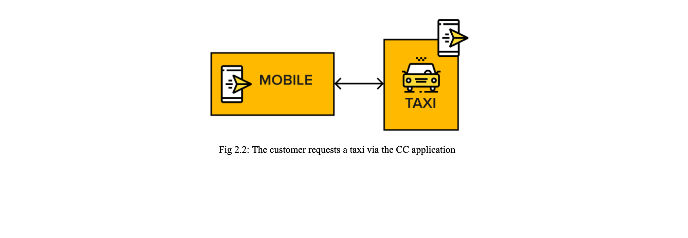
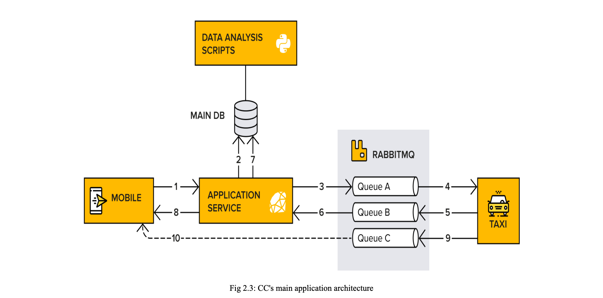

#### Building our app

1. Create a vhost using
    - `sudo rabbitmqctl add_vhost cc-dev-vhost`
2. Create user cc-dev
    - `sudo rabbitmqctl add_user cc-dev taxi123`
3. Give miracool user (the admin) and the cc-dev user full access to **cc-dev-vhost** vhost.
    - `sudo rabbitmqctl set_permissions -p cc-dev-vhost miracool ".*" ".*" ".*"` (see [triplet permission](./setup.md#configuring-dedicated-vhosts))
    - `sudo rabbitmqctl set_permissions -p cc-dev-vhost cc-dev ".*" ".*" ".*"`
4. 

#### architecture behind CC
- CC needs one application that is used by the taxi drivers 
- another application that is used by the customer. 
- The customer should be able to request a taxi via the application, and the taxi driver should be able to accept a request (the ride):

The endgoal is that

- The customer should be able to enter information about the starting point and the endpoint of the trip. 
- Active drivers receive the requests and are able to accept them. 
- The customer should, in the end, be able to follow the location of the taxi during the trip.

#### Information flow in CC

Data flow in CC can be explained in 10 steps, as highlighted below:

1. A customer uses CC's mobile application to book a taxi. A request is now sent from the mobile application to the Application Service. This request includes information about the trip that the customer wants to book.
2. The Application Service stores the request in a database.
3. The Application Service adds a message with information about the trip to a queue in RabbitMQ.
4. Connected taxi cars subscribe to the message (the booking request).
5. A taxi responds to the customer by sending a message back to RabbitMQ.
6. The Application Service subscribes to the messages.
7. Again, the Application Service stores the information in a database.
8. The Application Service forwards the information to the customer.
9. The taxi app starts to automatically send the taxi's geographical location at a given interval to RabbitMQ.
10. The location of the taxi is then passed straight to the customer's mobile application, via WebSockets, so that they know when the taxi arrives.

All these can be illustrated in the diagram below.

> NOTE: An Advanced Message Queuing Protocol (AMQP) connection is a link between the client and the broker that performs underlying networking tasks, including initial authentication, IP resolution, and networking: Each AMQP **connection** maintains a set of underlying **channels**. A channel reuses a connection, forgoing the need to reauthorize and open a new TCP stream, making it more resource-efficient.
 