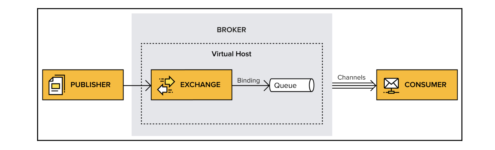

### Definition
> RabbitMQ is a message broker, providing a communication structure between components and services. Thanks to the Advanced Message Queuing Protocol (AMQP)
RabbitMQ is an open source message broker that acts as the intermediary or middleman for independent applications, giving them a common platform to communicate. RabbitMQ mainly uses an *Erlang*-based implementation of the Advanced Message Queuing Protocol (AMQP),

Messaging or message queuing is a method of communication between applications or components.

### Explaining message queues

Systems need to communicate and send messages between each other. They sometimes need to be sure that the message that's been sent has reached its destination, and sometimes they need to receive an immediate response. 

Message queuing is a one-way communication style that provides asynchronous interaction between systems.
One system asynchronously interacts with another system via messages, generally through a message broker.

Systems and applications play both the role of message publishers (producers) and message consumers (subscribers). A publisher publishes a message to a broker that they rely on to deliver the data to the intended consumer.

### Meet AMQP
**AMQP (Advanced Message Queuing Protocol)** is an open standard protocol that defines how a system can exchange messages. The protocol defines a set of rules that needs to be followed by the systems that are going to communicate with each other.
AMQP is truly interoperable as it specifies the wire format for messages, leaving nothing open to interpretation by a particular vendor or hosting platform. RabbitMQ is built upon the AMQP 0-9-1 specification.

### Core Concepts of AMQP implementation
**Broker or message broker:** A broker is a piece of software that receives messages from one application or service, and delivers them to another application, service, or broker.

**Virtual host, vhost:** A vhost exists within the broker. It's a way to separate applications that are using the same RabbitMQ instance. for example, separating working environments into production on one vhost and staging on another, keeping them within the same broker instead of setting up multiple brokers. Users access are restricted on each vhost

**Connection:** Physical network (TCP) connection between the application (publisher/consumer) and a broker. 

**Channel:** A channel is a virtual connection inside a connection. It reuses a connection, forgoing the need to reauthorize and open a new TCP stream. When messages are published or consumed, it is done over a channel. Many channels can be established within a single connection. A channel reuses a connection, forgoing the need to reauthorize and open a new TCP stream, making it more resource-efficient.

**Queue:** A queue is a sequence of items; in this case, messages. The queue exists within the broker.

**Exchange:** The exchange entity is in charge of applying routing rules for messages, making sure that messages are reaching their final destination. The exchange ensures that the received message ends up in the correct queues. Which queue the message ends up in depends on the rules defined by the exchange type. A queue needs to be bound to at least one exchange to be able to receive messages. 

**Binding:** A binding is a virtual link between an exchange and a queue within the broker. It enables messages to flow from an exchange to a queue.

### The RabbitMQ broker

RabbitMQ is an Erlang implementation of an AMQP broker. It implements Version 0-9-1 of AMQP with custom extensions, as allowed by the protocol. 

*Erlang has been chosen because of its intrinsic support for building highly reliable and distributed applications. Indeed, Erlang is used to run telecommunication switches in several large telecommunication systems. Erlang is able to run on any operating system.*

For data persistence, RabbitMQ relies on **Mnesia**, the in-memory/file-persisted embedded database of Erlang. Mnesia stores information about **users**, **exchanges**, **queues**, **bindings**, and so on. The queue index stores message positions and information on whether a message has been delivered or not. Messages are stored either in the queue index or in the message store, a key-value store shared among all queues.

RabbitMQ can be set up on a single, standalone instance, or as a cluster on multiple servers(Erlang's ingrained clustering abilities easily helps this feature)

### Uses of RabbitMq

- Message queues between microservices
- Event and tasks: Email event is sent, a consumer creates a task to forward the email to the receipient

### Books
- https://www.packtpub.com/product/rabbitmq-essentials-second-edition/9781789131666