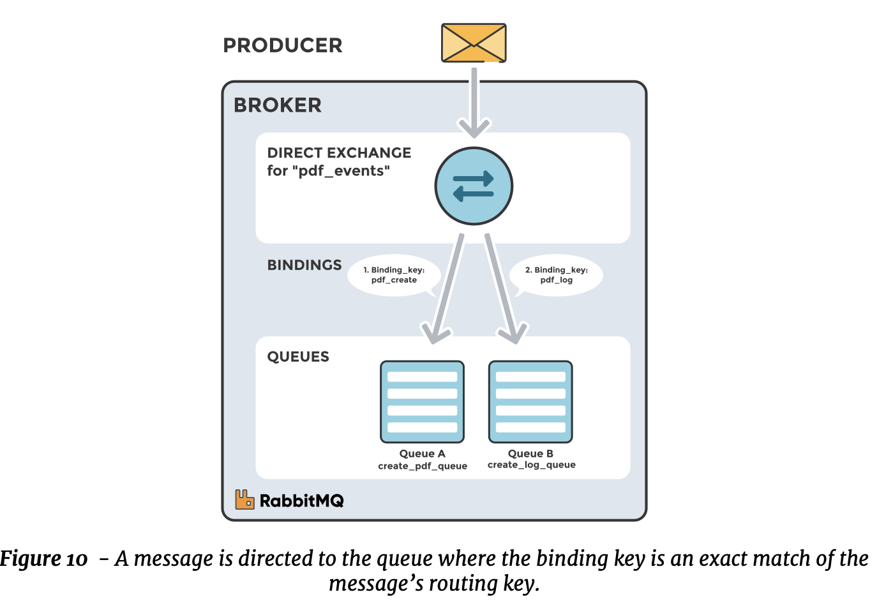
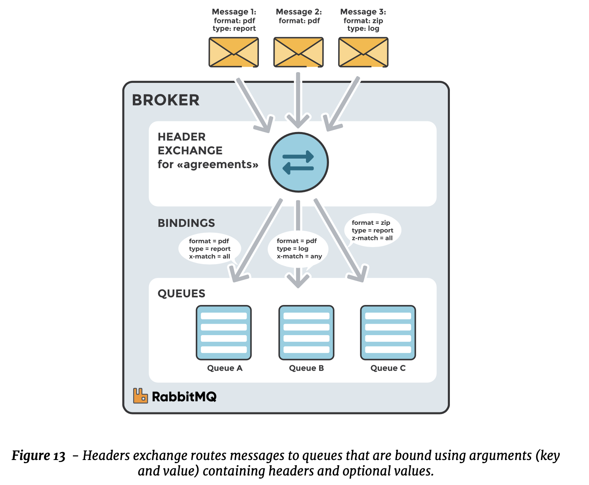
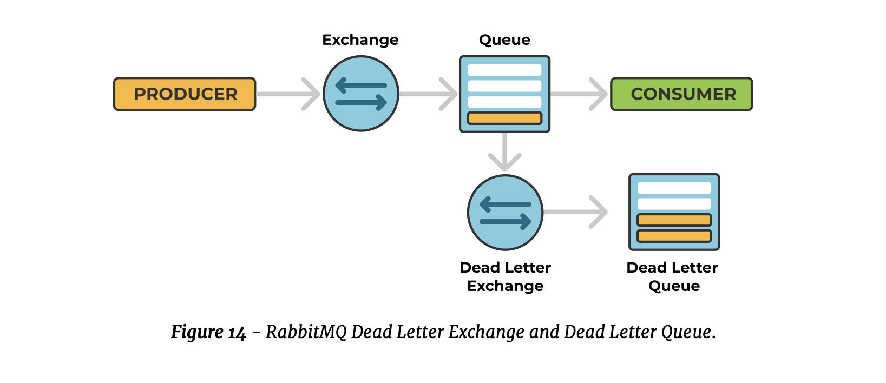

> Applications that are going to exchange messages over RabbitMQ need to establish a permanent connection to the message broker. When this connection is established, a channel needs to be created so that message-oriented interactions, such as publishing and consuming messages, can be performed.

### Exchanges
Exchanges are message routing agents, living in a virtual host (vhost) within RabbitMQ. Exchanges accept messages from the producer application and route them to message queues with the help of header attributes, bindings, and routing keys.

**A binding** is a *link* configured to make a connection between a queue and an exchange. The **routing key** is a message attribute the exchange uses to route the message to the correct queue..

Messages are not published directly to a queue. Instead, the producer sends a message to an exchange that routes them to the correct message queues.
The exchange does this with the help of **bindings and routing keys**. 
- Bindings link the queue to an exchange and 
- routing keys act as an address for the message. 
Routing keys are what the exchange looks for when deciding how to route messages to queues.

### Message Flow in RabbitMQ

1. The producer publishes a message to an exchange. When creating an exchange, its **type** must be specified. The different types of exchanges are explained in detail later on in this book.
2. The exchange receives the message and is now responsible for the routing of the message. The exchange looks at different message attributes and keys depending on the exchange type.
3. The exchange routes the message to the correct queue, depending on the attributes the message decleared.
4. The messages stay in the queue until the consumer processes them.
5. The broker removes the message from the queue once the consumer confirms that the message has been received and processed.

### Types of Exchanges

In RabbitMQ, four different types of exchanges route the message differently using different parameters and bindings setups

##### DIRECT EXCHANGE
A direct exchange delivers messages to queues based on a **routing key**. The routing key is a message attribute added to the message by the producer. Think of the routing key as an **address** that the exchange uses to decide on how to route the message.
A message goes to the queue(s) that exactly matches the binding key to the routing key of the message.

from the picture above: Queue A (create_pdf_queue) is bound to a direct exchange (pdf_events) with the binding key (pdf_create). When a new message with the routing key (pdf_create) arrives at the direct exchange, the exchange routes it to the queue where the binding_key = routing_key, in this case to queue A (create_pdf_queue).

Most brokers have a default exchange called **Default exchange**,

##### TOPIC EXCHANGE
Topic exchanges route messages to a queue based on a **wildcard match between the routing key and the routing pattern**, which is specified by the queue binding. Messages can be routed to one or many queues depending on this wildcard match. This means the wildcard is going to be used against the routing keys (we are matching the routing keys not the queues).
The routing key must be a **list of words delimited by a period (.)**. Examples include agreements.us or agreements.eu.stockholm, which in this case identifies agreements that are set up for a company with offices in different locations.
The routing patterns may contain an asterisk ( \* ) to match a word in a specific position of the routing key (e.g., a routing pattern of **agreements.\*.\*.b.\*** only match routing keys where the first word is agreements and the fourth word is "b").
A pound symbol **( # )** indicates a match on zero or more words (e.g., a routing pattern of agreements.eu.berlin.# matches any routing keys beginning with agreements.eu.berlin).

##### FANOUT EXCHANGE
Fanout exchanges copy and route a received message to all queues that are bound to it regardless of routing keys or pattern matching, unlike direct and topic exchanges. **If routing keys are provided, they will be ignored**.

Fanout exchanges can be useful when the same message needs to be sent to one or more queues with consumers who may process the same message in different ways, like in distributed systems designed to broadcast various state and configuration updates.

##### HEADERS EXCHANGE

A headers exchange routes messages based on arguments contained in headers and optional values. Headers exchanges are very similar to topic exchanges, but route messages based on header values instead of routing keys. A message matches if the value of the header equals the value specified upon binding.
A special argument named **"x-match"**, added in the binding between the exchange and the queue, specifies if all headers must match or just one. Either any common header between the message and the binding counts as a match or all the headers referenced in the binding need to be present in the message for it to match.
The *"x-match"* property can have two different values: **"any"** or **"all"**, where "all" is the default value. A value of "all" means all header pairs (key, value) must match, while value of "any" means at least one of the header pairs must match. Headers can be constructed using a wider range of data types, for example, integer or hash, instead of a string.

##### DEAD LETTER EXCHANGE

RabbitMQ provides an AMQP extension known as the dead letter exchange. **A message is considered dead when it has reached the end of it's time-to-live, the queue exceeds the max length (messages or bytes) configured, or the message has been rejected by the queue or nacked by the consumer for some reason and is not marked for re-queueing**.
 A dead-lettered message can be republished to an exchange called dead letter exchange. The message is routed to the dead letter exchange either with the routing key specified for the queue they were on or with the same routing keys with which they were originally published.

 

#### Internals

Creating connections is a costly operation, very much like it is with database connections. Typically, database connections are pooled, where each instance of the pool is used by a single execution thread. AMQP is different in the sense that a single connection can be used by many threads through many multiplexed channels.

A routing strategy determines which queue (or queues) the message will be routed to. The routing strategy bases its decision on a routing key (a free-form string) and potentially on message meta-information.
